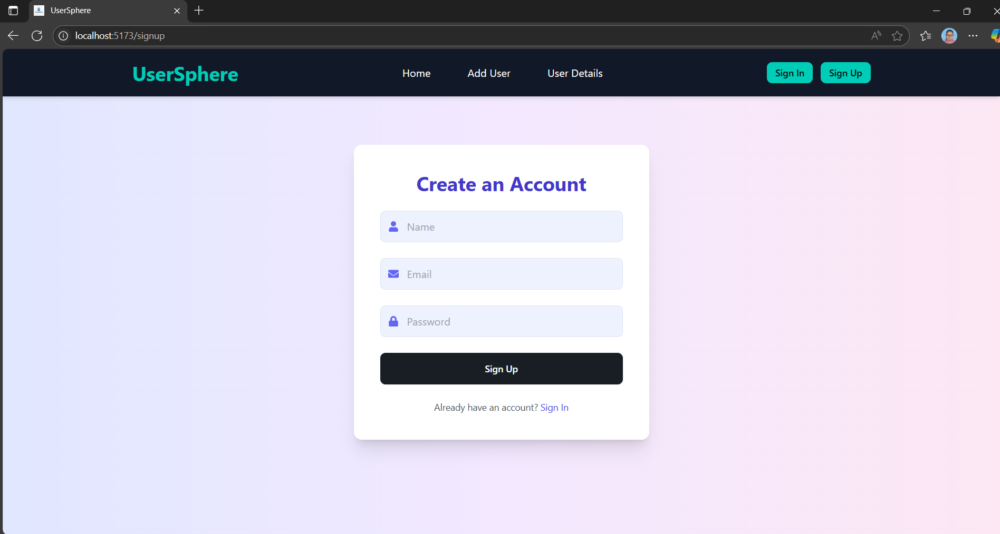
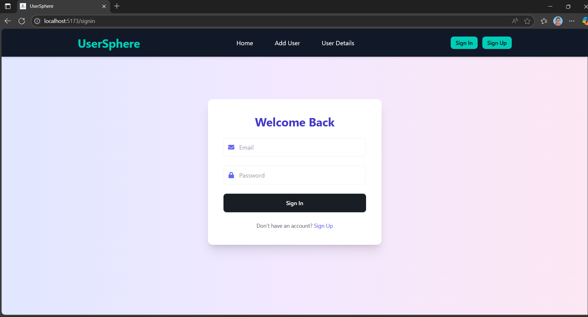
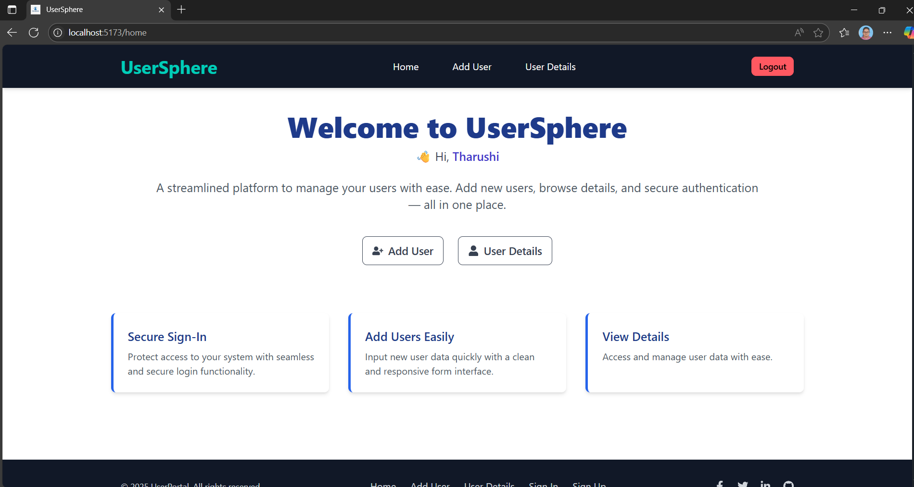

# 🌀 UserSphere - Modern User Management System

UserSphere is a modern user management system built with the MERN stack (MongoDB, Express, React, Node.js). It offers user authentication, user CRUD operations, PDF export, responsive UI, and both frontend and backend validations.

---

## 🚀 Features

- ✅ User SignUp and SignIn with JWT Authentication
- 🔒 Protected Routes (Add / View Users only after login)
- 👤 Add, Edit, Delete User Details
- 🔍 Real-time Search with Match Highlighting
- 📄 Export User Table to PDF
- ✅ Form Validations (Frontend & Backend)
- 📱 Fully Responsive UI (TailwindCSS + DaisyUI)
- 📦 Clean Code with MVC Architecture

---

## 🛠️ Tech Stack

- **Frontend**: React, TailwindCSS, DaisyUI, React-Router, react-hot-toast, jsPDF
- **Backend**: Node.js, Express, MongoDB, Mongoose, bcrypt, JWT
- **Others**: LocalStorage Auth, PDF Export, Regex Validations

---
### 📝 Sign Up
New users can register through this clean form.

### 🔐 Sign In
Secure login for authorized access.

### 🏠 Home Page
The landing screen with quick access to Add User and User Details.

### ➕ Add User
Simple and validated form to add new users.

### 📋 User Details
Displays a paginated, searchable, and downloadable list of all users.

---

