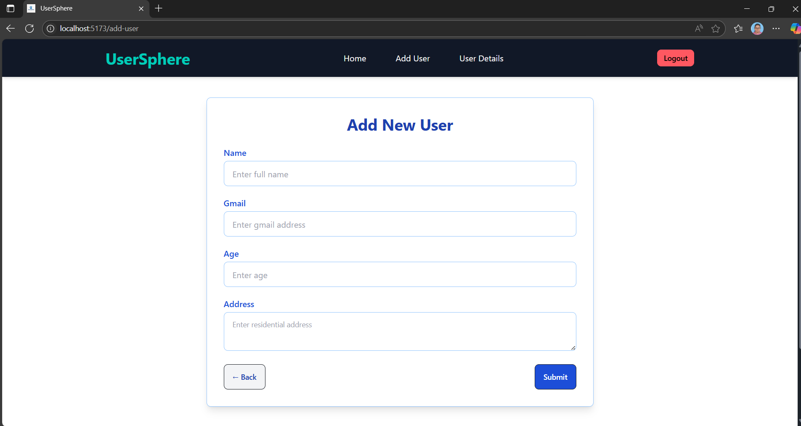
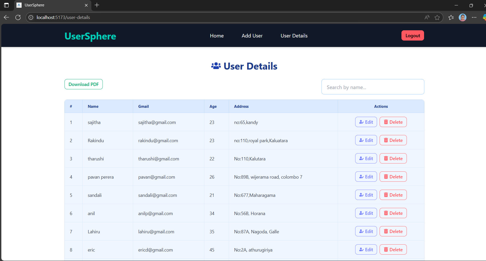

# 🌀 UserSphere - Modern User Management System


A **full-stack User Management System** built with the **MERN** stack (MongoDB, Express, React, Node.js). Manage users with signup, signin, user CRUD, and a clean, responsive UI.
---

## ✨ Project Overview

UserSphere is a learning project designed to practice MERN stack development with a focus on:

- User authentication (signup/signin)  
- User management (add/edit/delete)  
- Responsive UI with Tailwind & DaisyUI  
- Real-time notifications with `react-hot-toast`  

## 🌟 Features

- ✅ User Registration (Signup)  
- 🔐 User Login (Signin) with session management  
- 🏠 Dashboard/Home page after login  
- ➕ Add new users with detailed forms  
- 📋 View user details in a searchable and paginated table  
- ✏️ Edit and 🗑️ Delete users with confirmation alerts  
- 🎨 Responsive UI with Tailwind CSS and DaisyUI  
- 🔔 Notifications using `react-hot-toast`  
- 🔒 Secure password hashing and validation  

---

## 🛠️ Technologies Used

| Frontend                | Backend               | Database           | Tools & Libraries          |
|-------------------------|-----------------------|--------------------|----------------------------|
| React                   | Node.js & Express.js  | MongoDB            | Tailwind CSS & DaisyUI     |
| React Router DOM        | JWT Authentication    |                    | react-hot-toast            |
| React Icons             | Bcrypt (Password Hash)|                    | Git & GitHub 

---
### 📝 Sign Up
New users can register through this clean form.


### 🔐 Sign In
Secure login for authorized access.


### 🏠 Home Page
The landing screen with quick access to Add User and User Details.


### ➕ Add User
Simple and validated form to add new users.



### 📋 User Details
Displays a searchable, and downloadable list of all users.



---
## ⚙️ Installation

1. **Clone the repository**

```bash
git clone https://https://github.com/Tharushi111/User-Management-System
cd UserSphere


