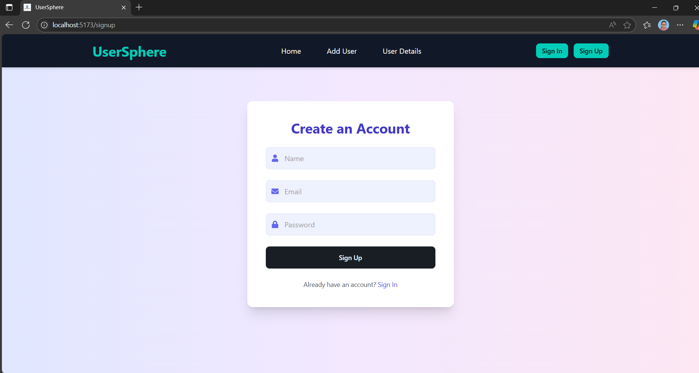
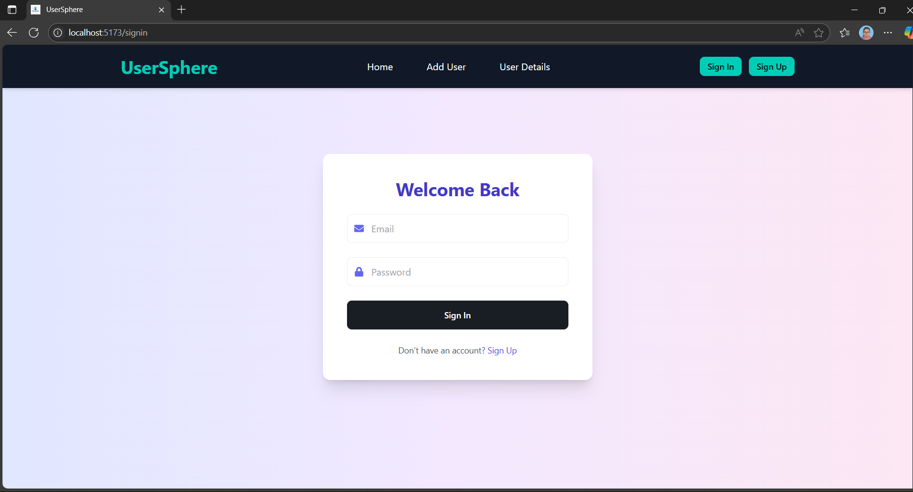
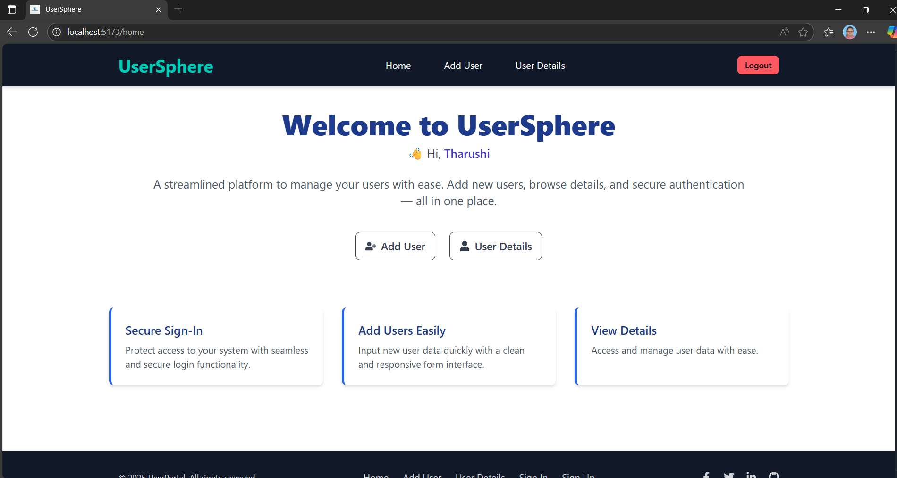
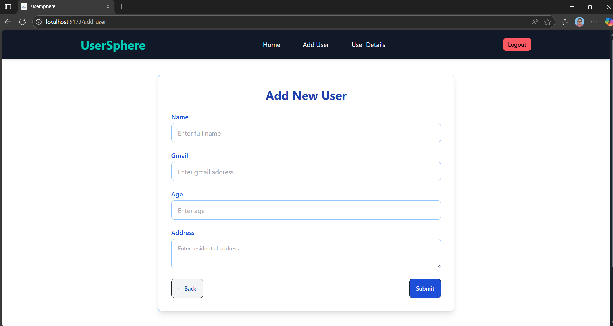
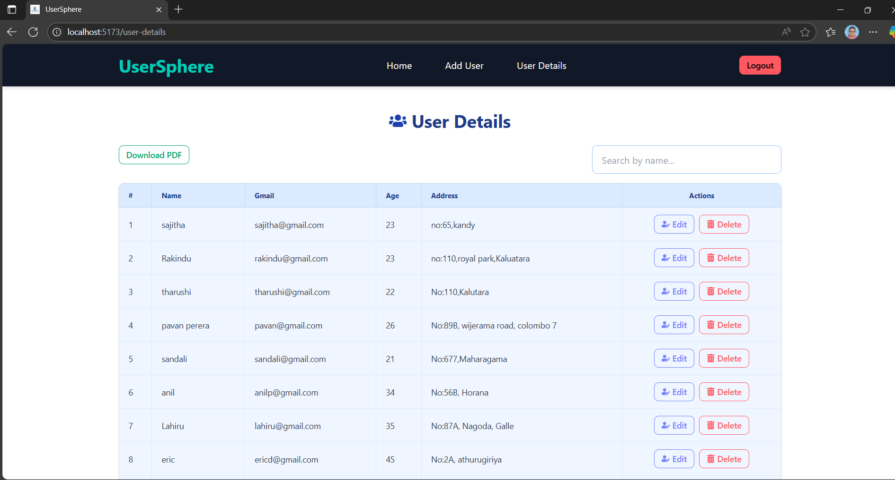

#  UserSphere - Modern User Management System


A **full-stack User Management System** built with the **MERN** stack (MongoDB, Express, React, Node.js). Manage users with signup, signin, user CRUD, and a clean, responsive UI.
---

##  Project Overview

UserSphere is a learning project designed to practice MERN stack development with a focus on:

- User authentication (signup/signin)  
- User management (add/edit/delete)  
- Responsive UI with Tailwind & DaisyUI  
- Real-time notifications with `react-hot-toast`  

##  Features

-  User Registration (Signup)  
-  User Login (Signin) with session management  
-  Dashboard/Home page after login  
-  Add new users with detailed forms  
-  View user details in a searchable and paginated table
-  Search bar with autocomplete suggestions — type the first letter(s) to filter user names instantly
-  Edit and  Delete users with confirmation alerts
-  Download user details as PDF reports for easy sharing and printing 
-  Responsive UI with Tailwind CSS and DaisyUI  
-  Notifications using `react-hot-toast`  
-  Secure password hashing and validation  

---

##  Technologies Used

| Frontend                | Backend               | Database           | Tools & Libraries          |
|-------------------------|-----------------------|--------------------|----------------------------|
| React                   | Node.js & Express.js  | MongoDB            | Tailwind CSS & DaisyUI     |
| React Router DOM        | JWT Authentication    |                    | react-hot-toast            |
| React Icons             | Bcrypt (Password Hash)|                    | Git & GitHub 

---
### Sign Up
New users can register through this clean form.



### Sign In
Secure login for authorized access.



###  Home Page
The landing screen with quick access to Add User and User Details.



###  Add User
Simple and validated form to add new users.



###  User Details
Displays a searchable, and downloadable list of all users.



---
##  Installation

1. **Clone the repository**

```bash
git clone https://https://github.com/Tharushi111/User-Management-System
cd UserSphere
```

2. **Install frontend dependencies**

```bash
cd frontend
npm install
```

3. **Install backend dependencies**

```bash
cd ../backend
npm install
```

4. **Setup environment variables**

Create a .env file inside backend folder with:

```env
MONGO_URI=your_mongodb_connection_string
JWT_SECRET=your_jwt_secret_key
PORT=5000
```
5. **Start backend server**

```bash
npm run dev
```
6. Start frontend app

```bash
cd ../frontend
npm run dev
```

##  Contact
- Tharushi Paranagama
- Email: tharushiparanagama1@gmail.com


